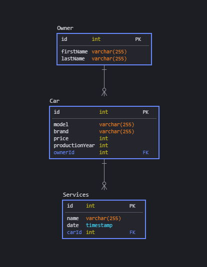

# Fast REST API with Node.js, Prisma, PostgreSQL, Fastify and Swagger

### Functionality

- adding car owners
- adding owner's cars
- adding car's service history

## Database schema

## Running API

- clone repo and run `npm install`
- run postgresql i.e. `sudo service postrgresql start` or in docker
- provide user name and password in `.env` file (user has to have permission for CREATE DATABASE)
- run `npm start`
- open localhost:5000/docs for swagger api testing
